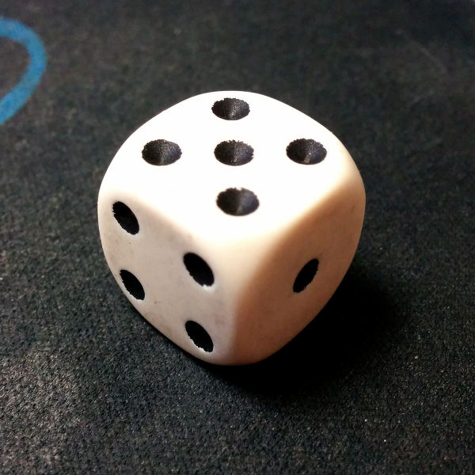

# simple-dice-password



I was walking to work and I found a beat up dice on the ground. Suddenly I thought about using a single dice to make a strong password. This is what I came up with:

## 2 to 3 rolls per character

First roll for the row. Then roll for the digit. My first two rolls were 6 and 1 so I get 5.
My second roll was 2, 4, and 4.

2 is the row, 4 is the letter J, and I rolled even so I made it uppercase.

```
1 : A B C D E F
2 : G H I J K L
3 : M N O P Q R
4 : S T U V W X
5 : Y Z 1 2 3 4
6 : 5 6 7 8 9 0
```

**Optional**

Roll odd for lowercase and even for uppercase is totally optional.

I did a test and generated this password:

```
5JnX-Jy8N-gfJA-3fow
```

It's just that easy.

